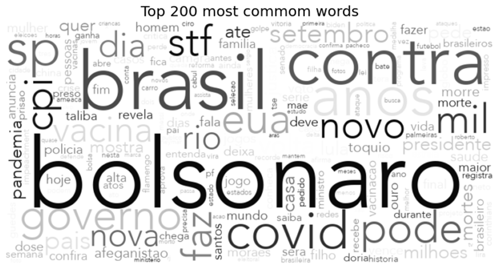

<h1 align="center">
   <a href="#"> LSTM - News Headline Generator </a>
</h1>

<h3 align="center">
    💻📰 Your Computer creating News Headline! 📰💻
</h3>

<h4 align="center"> 
	 Status: Finished
</h4>

 <a href="#about">About</a> •
 <a href="#how-it-works">How it works</a> • 
 <a href="#results">Results</a> • 
 <a href="#author">Author</a> • 

## About

📰 News Headline Generator - LSTM

This project consists on building an LSTM model that generates a Headline based on an initial word.

In addition to the generator, this project also includes data scrapping for the model training and an exploratory analysis.

The whole project was written in python (BeautifulSoup | Pandas | Tensorflow).

---

## How it works

This project is divided into three parts:
1. Data Gathering (Web Scrapping)
2. Exploratory Analysis
3. Model Training

### 1. Data Gathering

Before we train our model, we need to have data to use as input, but there is no structured database with news headlines available.

So, the solution was to built a scrapper to get the headlines from the largest news portals in Brazil.

The headlines were scrapped from the following portals:
* [Band](https://www.band.uol.com.br)
* [BBC](https://www.bbc.com/portuguese)
* [Brasil de Fato](https://www.brasildefato.com.br/)
* [Carta Capital](https://www.cartacapital.com.br/)
* [Conexão Política](https://www.conexaopolitica.com.br/)
* [Deutsche Welle](https://www.dw.com/pt-br/not%C3%ADcias/s-7111)
* [El Pais](https://brasil.elpais.com/)
* [Estadão](https://www.estadao.com.br/)
* [Folha de SP](https://www.folha.uol.com.br/)
* [Gazeta do Povo](https://www.gazetadopovo.com.br/)
* [Globo](https://www.globo.com/)
* [iG](https://www.ig.com.br/)
* [Isto É](https://istoe.com.br/)
* [Jornal da Cidade](https://www.jornaldacidadeonline.com.br/)
* [Pleno News](https://pleno.news/)
* [R7](https://www.r7.com/)
* [Renova Mídia](https://renovamidia.com.br/)
* [Revista Forúm](https://revistaforum.com.br/)
* [Terça Livre](https://tercalivre.com.br/)
* [UOL](https://www.uol.com.br/)
* [Veja](https://veja.abril.com.br/)

**Techniques**:

To get the headlines, all websites from all portals were analyzed to understand their structureand how to scrap them.

BeautifulSoup and Requests were used in the process of retrieving data from all websites.

--

**Results**:

The headlines were scrapped from 25.07 to 14.10.21, resulting on a total of 96.861 headlines (they are found in the [Manchetes](https://github.com/hlweber/Headline-News-Generator/tree/main/Manchetes) directory) with the following distribution per Portal:

--

### 2. Exploratory Analysis

The second python file performs 3 differents exploratory analysis:

* **Count of different words per Portal**:

This first analysis counts the number of different words that were used by each portal and also show how many of these words are commom to every portal.

* **Similarity of Portal Vocabulary**:

This analysis consists of measuring the similarity between the portals, according to the words used, that is, if two portals use the same words, the same number of times, they would have perfect similarity.

In the graph, the clearer (closer to zero), the greater the similarity

* **Word Cloud**:

Finally, and in addition to the previous analyses, the word cloud of each of the portals was plotted, where the larger the word, the more times it was used in the headlines of that portal.

--

### 3. Model Training

**Data Prep**:

Before building the model, we need to make some data prep.

The followings transformation were made:
* Removal of links and emojis
* All letters to lower case
* All words into Token (each word corresponding to a unique number)

The transformation of words into tokens was necessary for input into the neural network, the other treatments were to remove information that were not relevant to the model and to standardize words.

**Model Training**:

To generate headlines, we used an LSTM model, a supervised model that receives a sequence of tokens (equivalent to word) as input and the target is the next token of the sequence.

This network has the power to 'record' the past values of a sequence to predict its future value, what is extremely important on a phrase generating model

---

## Results

Its hard to define some metric to measure the success of this model, as language is very fluid and there are a lot of words that makes sense after a sequence of words.

That being said, the model accuracy on the test set was around 0.01. But, maybe, the best way to measure its success is to generate some headlines and see if it makes sense.

Two examples were generated from two different models, one model was trained using only the headlines from Globo and the other only from UOL.

We gave the model a word as input - 'Bolsonaro' (Brazilian President from 2019-2023) - and asked for a 11 words long headline, these are the results:

* *Globo Model:* "Bolsonaro É Preso Por Suspeita De Estupro De Vulnerável Em Rodovia" - Bolsonaro is arrested on suspicion of rape of a vulnerable person on the highway
* *UOL Model:* "Bolsonaro É O Futuro Da Justiça E O Que É O" - Bolsonaro Is The Future Of Justice And What Is The

The first model makes more grammatical sense and is able to capture some interesting relationships like 'arrested' and 'rape', 'rape' and 'vulnerable', 'vulnerable' and 'person'.

The second model was not as good as the first one, but both of them seems to show some kind of relationship between Bolsonaro and justice themes

---

## Author

#### Henrique L. Weber

 

